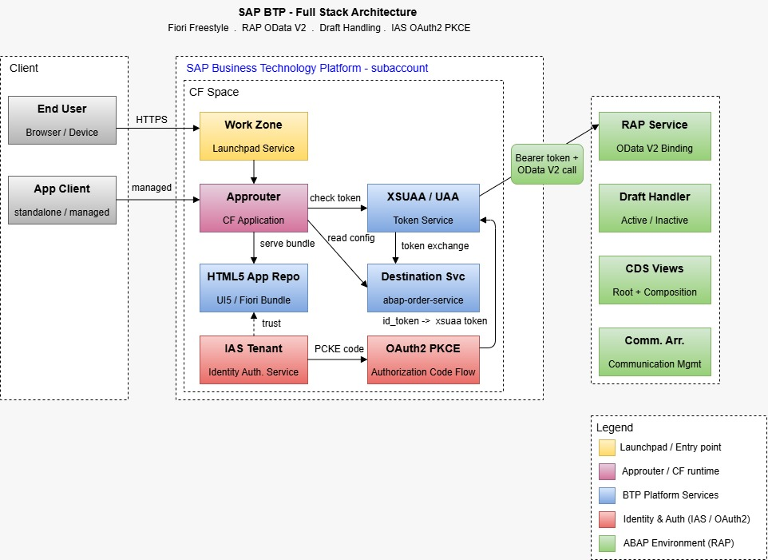

# 🛒 Order Cart App — SAP BTP Full Stack


> Full-stack SAP BTP application for cart and order management — built with **RAP (ABAP RESTful Application Programming)**, **Draft Handling**, **OData V2 Batch**, and secured via **IAS OAuth2 PKCE**.

--

## Architecture




## Tech Stack

| Backend | Frontend |
|---|---|
| ABAP BTP Cloud | SAP UI5 / Fiori Freestyle |
| RAP — Managed Business Object | TypeScript (strict) |
| CDS Views + Behavior Definition | OData V4 Batch Requests |
| Draft Handling (active / inactive) | PKCE / OAuth2 / IAS |
| Function Import `decrease_quantity` | Optimistic UI + Rollback |
| OData V4 (read, create, function call) | Repository + Interface pattern |


## Key Technical Features

### Backend — RAP / ABAP BTP
- **Draft-enabled RAP Business Object** — `Orders` composition to `OrderItems`, full active/inactive entity lifecycle
- **CDS Root View + Projection** — behavior definition with draft actions (`Edit`, `Activate`, `Discard`)
- **Custom Function Import** — `decrease_quantity` called via OData batch to decrement item quantity atomically
- **OData V2 exposure** — all CRUD operations exposed through a single RAP service binding

### Frontend — Fiori Freestyle / TypeScript
- **OData V2 Batch** — groups POST + 2× GET into a single HTTP request to minimize round-trips
- **Optimistic UI** — cart updates locally before backend confirmation; rolls back on failure
- **Sync reconciliation** — compares local total vs. backend total after each batch; detects and corrects divergence
- **Typed error layer** — domain errors (`CartSyncError`, `CartAddError`, `CartDeleteError`) with context payload
- **Repository pattern** — all OData calls abstracted behind interfaces (`IOrderRepository`, `ICartStore`…)

### Authentication — IAS / OAuth2 PKCE
```
1. User clicks Login
2. App generates code_verifier + code_challenge (SHA-256)
3. Redirect → IAS Authorization endpoint
4. IAS returns authorization code
5. App exchanges code + verifier → id_token
6. Token stored in sessionStorage + localStorage
7. Session validated on each view init (exp check)
```


## Project Structure

├── backend/
│   ├── CDS/
│   │   ├── ZI_ORDER_K.cds         # Interface view — Orders
│   │   ├── ZI_LINE_ITEM.cds       # Interface view — Order Items
│   │   ├── ZI_PRODUCT.cds         # Interface view — Products
│   │   ├── ZC_ORDER_K.cds         # Consumption view — Orders
│   │   ├── ZC_LINE_ITEM.cds       # Consumption view — Items
│   │   └── ZC_PRODUCT.cds         # Consumption view — Products
│   ├── Behavior/
│   │   ├── ZI_ORDER_K.bdef        # Draft-enabled behavior definition
│   │   ├── ZBP_ORDER_K.clas.abap  # Order behavior implementation
│   │   ├── ZBP_PRODUCT.bdef       # Product behavior definition
│   │   └── ZBP_PRODUCT.clas.abap  # Product behavior implementation
│   └── Service/
│       ├── ZUI_ORDER_SRV.srvd     # Service definition
│       └── ZUI_ORDER_SRV.srvb     # Service binding (OData V2)
│
└── frontend/
    ├── auth/
    │   └── AuthService.ts         # PKCE / OAuth2 / IAS authentication
    ├── Services/
    │   ├── CartServiceProcess.ts  # Cart orchestration + optimistic UI
    │   └── BatchServiceProcess.ts # OData batch request builder
    ├── Repositories/
    │   ├── OrderImpl.ts           # OData order calls
    │   └── OrderItemImpl.ts       # OData order item calls
    ├── Helpers/
    │   └── oDataRequestError.ts   # Typed domain error handling
    └── Controllers/
        ├── Product.controller.ts  # Product detail
        ├── ProductManagement.controller.ts  # CRUD management
        └── DashboardAdmin.controller.ts     # Admin dashboard

## Notable Engineering Decisions

- **Batch over individual calls** — a single `submitBatch` groups the action + 2 reads, avoiding cascading HTTP requests and race conditions
- **Optimistic UI with typed rollback** — the UI reflects changes instantly; any backend failure triggers a domain-scoped rollback without full page refresh
- **Draft isolation** — all mutations operate on `IsActiveEntity=false` until explicitly activated, preventing partial data exposure
- **PKCE without client secret** — the app runs entirely in the browser; PKCE replaces the client secret for the OAuth2 code exchange, compliant with RFC 7636

---

## Getting Started

### Prerequisites
- SAP BTP subaccount with ABAP environment instance
- IAS tenant configured (OAuth2 client with PKCE enabled)
- BTP destination pointing to the ABAP system

### Backend
```bash
# Deploy via abapgit or ADT
# 1. Import CDS views and behavior definitions
# 2. Activate service binding ZUI_ORDER_SRV
# 3. Assign to a communication arrangement
```

### Frontend
```bash
npm install
npm run start        # local dev (ui5 serve)
npm run build        # production build
# Deploy to BTP HTML5 Application Repository via MTA
```

---

## ⚠️ Known Limitation — BTP Trial Environment

The frontend is deployed and accessible via **SAP Build Work Zone** on a BTP Trial account.  
Backend communication currently fails in this environment due to **trial restrictions** :

- Cross-origin destination calls between the HTML5 app and the ABAP BTP instance are blocked on trial
- The ABAP environment and the Work Zone run on separate subaccounts — cross-subaccount trust configuration is limited on trial plans
- IAS OAuth2 token propagation to the backend service is not fully supported without a paid Communication Arrangement setup

> The full flow (UI → OData V4 → RAP → Draft tables) works correctly in a **local development environment** (`ui5 serve`) connected directly to the ABAP system via ADT destination.

This is a known BTP trial constraint, not an application bug.  
A productive BTP subaccount with proper destination and communication arrangement setup would resolve this.

## Author

> Built as a hands-on BTP full-stack project to explore RAP draft handling, OData V4 batch patterns, and IAS authentication in a real-world cart management context.

## Getting Started

### Prerequisites
- SAP BTP subaccount with ABAP environment instance
- IAS tenant configured (OAuth2 client with PKCE enabled)
- BTP destination pointing to the ABAP system

### Backend
```bash
# Deploy via abapgit or ADT
# 1. Import CDS views and behavior definitions
# 2. Activate service binding ZUI_ORDER_SRV
# 3. Assign to a communication arrangement
```

### Frontend
```bash
npm install
npm run start        # local dev (ui5 serve)
npm run build        # production build
# Deploy to BTP HTML5 Application Repository via MTA
```

---

## What I Learned

- Managing **draft entity consistency** during concurrent batch operations (optimistic lock strategy)
- Structuring a **clean architecture** in UI5 without a framework — pure TypeScript interfaces, dependency injection via constructor
- Handling **OData batch response parsing** with fixed index mapping and normalization across different adapter response shapes
- Implementing **PKCE from scratch** in the browser without any OAuth library

---

## Author

> Built as a hands-on BTP full-stack project to explore RAP draft handling, OData V4 batch patterns, and IAS authentication in a real-world cart management context.
